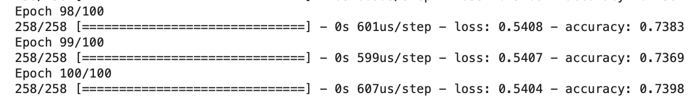
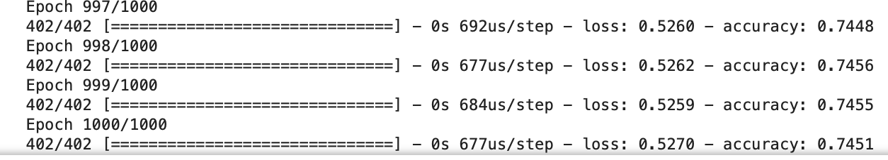

# deep-learning-challenge
## Module 21 Deep Learning Report

## Overview
* The purpose of this analysis is to figure out which organisation to receive charity based on information like income, typy of organisation, etc using deep neural network algorithms

## Results
* On a first approach we used all categorical values except the EIN and the NAME to create a dummy table, which we combined with the numerical ASK_AMT to create our feature dataset. We used IS_SUCCESSFUL as 
our target dataset

* On our optimization approach we tried to remove certain columns like STATUS, ORGANIZATION nd USE_CASE but we couldnt get meaningful improvement

* We also run an optimization algorithm with multiple hidden layers(up to 4) and incresed the number of neurons to 200 for the first layer, 100 for the second, 50 for the third and 20 for the fourth, but again no meaningful improvements

* We also tried various activation functions (relu, tanh, sigmoid) loss(BinaryCrossentropy, CategoricalCrossentropy, SparseCategoricalCrossentropy, MeanSquaredError) and optimizers(SGD, RMSprop, Adam, Adamax) but couldnt go past 75%

* We tried to improve performance by removing features that are not relevant, change the activation, loss and optimizers, increase the epochs and change the batch size

### Below we have the initial performance:

### And here we have the optimized performance:

## Summary
* This model gives us a 75% accuracy on whether a charity application should be approved. That shows that our feature set might not be complete and that we might need to obtain more information from the applicants

* We can also continue increasing the epoch and reudcing the buffersize as well as trying different optimizers, but there seems to be a solid 75% barrier which might indicate that the dataset is incomplete

